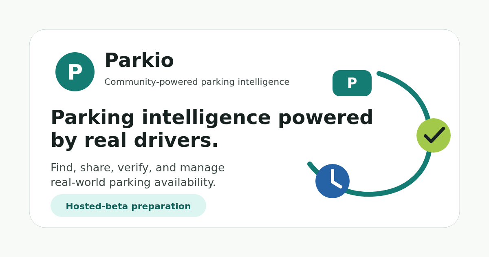

# Parkio

> Community-powered parking intelligence for drivers who need fresh, trustworthy
> parking availability signals.

[](https://github.com/ADBERILGEN35/parkio/actions/workflows/backend-ci.yml)
[](https://github.com/ADBERILGEN35/parkio/actions/workflows/frontend-ci.yml)
[](https://github.com/ADBERILGEN35/parkio/actions/workflows/security-ci.yml)
[](https://github.com/ADBERILGEN35/parkio/actions/workflows/supply-chain.yml)

Parkio helps drivers find, share, verify, and manage real-world parking
availability through a community-powered, privacy-conscious platform. A driver
can share a spot with photo/context, nearby drivers can verify, claim, or report
it, and Parkio uses trust signals, moderation, notifications, and optional Smart
Return workflows to keep the signal useful.

This repository is a Java 21 / Spring Boot microservices monorepo with a React
web app, Expo mobile app, PostgreSQL/PostGIS, Kafka, Redis, MinIO-compatible
media storage, observability, CI, runbooks, certification reports, startup docs,
and a public landing/waitlist path.

## Current Status

| Track | Status |
|-------|--------|
| Release line | `v1.0.0-rc1` hosted-beta release candidate |
| Application layer | Certified for hosted-beta preparation |
| Public landing | Static `parkio.dev` landing page is public-ready |
| Waitlist | Minimal public intake implemented; requires hosted env/database/Redis |
| Hosted beta | Preparation complete; live deployment must still be operator-verified |
| Public production | Not ready; see [Known Issues](docs/releases/KNOWN-ISSUES.md) |
| Open-source license | Not selected yet; see [License](#license) |

Parkio does **not** currently claim active users, revenue, funding,
partnerships, awards, production HA, or a live public beta.

## Preview

The web landing experience is implemented in
[`frontend/apps/web`](frontend/apps/web/) and public assets live under
[`frontend/apps/web/public`](frontend/apps/web/public/).



## Why Parkio Exists

Parking decisions are still made with stale guesses: a spot may be available,
blocked, illegal, risky, too far away, or already taken. Parkio treats parking as
a local intelligence problem:

- Fresh observations are more useful than static maps.
- Trust and verification matter more than one-off submissions.
- Privacy-sensitive location behavior must be explained and minimized.
- Hosted beta should prove real usage before public production claims.

## Architecture Overview

Parkio uses gateway-only ingress and independently deployable services. Each
service owns its own database/schema and communicates through HTTP APIs or Kafka
events. There are no shared domain models between services.

```text
Web / Mobile
    |
    v
Spring Cloud Gateway
    |
    +-- auth-service              PostgreSQL
    +-- user-service              PostgreSQL
    +-- parking-service           PostgreSQL + PostGIS
    +-- media-service             PostgreSQL + MinIO + ClamAV
    +-- gamification-service      PostgreSQL
    +-- notification-service      PostgreSQL
    +-- moderation-service        PostgreSQL
    +-- ai-validation-service     PostgreSQL
    +-- analytics-service         PostgreSQL
    |
    +-- Kafka events / DLTs
    +-- Redis rate limits / caches
    +-- Prometheus, Grafana, Loki, Alertmanager
```

Start with [Architecture Overview](docs/architecture/README.md), then read
[Service Boundaries](docs/ai-context/03-service-boundaries.md),
[Security Guidelines](docs/ai-context/07-security-guidelines.md), and
[Production Readiness](docs/architecture/production-readiness.md).

## Features

Implemented or documented in the current release line:

- Parking spot creation with media references and location context.
- Nearby parking discovery with PostGIS-backed search.
- Spot verification, claim, report, and moderation flows.
- Media upload pipeline with malware scanning and signed access URLs.
- Auth with RS256/JWKS, refresh-token rotation, session epoch, and web/mobile
  token transport separation.
- Gamification, trust/score foundations, notifications, and Smart Return beta
  workflows.
- Public landing page, waitlist intake, and hosted-beta legal placeholders.
- Docker Compose local/hosted-beta topology and operator scripts.
- Prometheus/Grafana/Loki/Alertmanager observability assets.
- CI for backend, frontend, mobile, security, supply chain, runtime validation,
  backup/restore, and performance smoke.

## Tech Stack

| Layer | Stack |
|-------|-------|
| Backend | Java 21, Spring Boot 3.5.x, Spring Cloud Gateway |
| Data | PostgreSQL, PostGIS, Flyway, Redis |
| Messaging | Kafka, transactional outbox/inbox, DLTs |
| Media | MinIO/S3-compatible storage, ClamAV scanning |
| Web | React, Vite, TypeScript, Tailwind, Playwright |
| Mobile | Expo, React Native, TypeScript |
| Tooling | Gradle Kotlin DSL, pnpm workspace, Docker Compose |
| Observability | Prometheus, Grafana, Loki, Alertmanager, OpenTelemetry |
| Security/Supply chain | gitleaks, Trivy, CodeQL gate, Dependabot, SBOMs |

## Repository Structure

| Path | Purpose |
|------|---------|
| [`services/`](services/) | Spring Boot microservices |
| [`frontend/`](frontend/) | Web app, mobile app, shared TypeScript packages |
| [`docker/`](docker/) | Local and hosted-beta Compose stack |
| [`scripts/`](scripts/) | Developer, deploy, preflight, backup, smoke scripts |
| [`docs/`](docs/) | Architecture, operations, release, startup, brand docs |
| [`docs/startup/`](docs/startup/) | Accelerator/investor/startup narrative package |
| [`docs/brand/`](docs/brand/) | Brand, voice, visual identity, copy guidance |
| [`docs/design/`](docs/design/) | Landing page, waitlist, CTA, SEO, flow specs |
| [`docs/certification/`](docs/certification/) | Certification reports and readiness decisions |
| [`benchmarks/`](benchmarks/) | k6 smoke/load harness |
| [`tools/`](tools/) | Operational utilities such as DLT redrive |
| [`platform/`](platform/) | Service-agnostic infrastructure helpers only |

## Quick Start

### Prerequisites

- JDK 21
- Docker Desktop or Docker Engine with Compose v2
- Node.js 20+ and Corepack
- pnpm version pinned by [`frontend/package.json`](frontend/package.json)

### Backend Build

```bash
./gradlew build
./gradlew integrationTest
```

`build` runs unit tests and does not require Docker. `integrationTest` runs
Testcontainers suites; add `-Pparkio.integrationTest.requireDocker=true` when a
Docker-backed run must fail instead of skip.

### Frontend Build

```bash
cd frontend
corepack pnpm install
corepack pnpm -r typecheck
corepack pnpm -r lint
corepack pnpm -r test
corepack pnpm -r build
```

If workspace-level test orchestration hangs in a local WSL/Windows environment,
run package-level tests:

```bash
corepack pnpm --filter @parkio/api-client test
corepack pnpm --filter @parkio/web test
corepack pnpm --filter @parkio/mobile test -- --runInBand
```

### Local Stack

```bash
cd docker
cp .env.example .env
docker compose -f docker-compose.yml -f docker-compose.apps.yml up -d --build
```

Read [docker/README.md](docker/README.md) before running the full stack. It
documents required secrets, service ports, health checks, backup/restore, hosted
beta overlays, and common troubleshooting.

## Development

Common commands:

| Command | Purpose |
|---------|---------|
| `./gradlew build` | Compile and unit-test backend services |
| `./gradlew integrationTest` | Run backend integration suites |
| `./gradlew :services:<service>:test` | Test one backend service |
| `./gradlew :services:<service>:bootRun` | Run one backend service |
| `cd frontend && corepack pnpm -r typecheck` | Typecheck frontend workspace |
| `cd frontend && corepack pnpm --filter @parkio/web dev` | Start web app |
| `cd frontend && corepack pnpm --filter @parkio/web exec playwright test` | Run web e2e |
| `scripts/preflight-hosted-beta.sh` | Validate hosted-beta env before deploy |

Contributor rules live in [CONTRIBUTING.md](CONTRIBUTING.md) and
[`docs/ai-context/`](docs/ai-context/).

## Hosted Beta Status

Parkio is in hosted-beta preparation. The repository contains:

- Hosted-beta Docker Compose overlays.
- Caddy/TLS routing configuration.
- Environment templates.
- Deploy, rollback, preflight, smoke, backup, and restore scripts.
- Operator runbooks.
- Public landing page, waitlist intake, and beta legal placeholders.

The repository does **not** prove that a live VPS deployment is currently
running. Operators should start with the single
[Hosted Beta Runbook](HOSTED-BETA-RUNBOOK.md), then record live evidence in
[Hosted Beta Deployment Report](docs/releases/RC2-HOSTED-BETA-DEPLOYMENT-REPORT.md).

## Roadmap

| Horizon | Focus |
|---------|-------|
| Current | Repository excellence, hosted-beta readiness, honest public docs |
| Next | Operator-verified hosted beta deployment and smoke evidence |
| Beta | Small invite cohorts, waitlist operations, mobile device proof |
| Later | Managed data services, PITR, stronger CD rollback, public production hardening |

Canonical roadmap source: [docs/startup/07-roadmap.md](docs/startup/07-roadmap.md).
Known limitations: [docs/releases/KNOWN-ISSUES.md](docs/releases/KNOWN-ISSUES.md).

## Documentation Index

| Need | Start here |
|------|------------|
| Product overview | [Startup README](docs/startup/README.md) |
| Architecture map | [Architecture README](docs/architecture/README.md) |
| Service boundaries | [Service Boundaries](docs/ai-context/03-service-boundaries.md) |
| Security model | [Security Guidelines](docs/ai-context/07-security-guidelines.md) |
| Event transport | [Kafka Transport](docs/architecture/kafka-transport.md) |
| Observability | [Observability Metrics](docs/architecture/observability-metrics.md) |
| Operations | [Operations docs](docs/operations/) |
| Hosted beta deploy | [Hosted Beta Runbook](HOSTED-BETA-RUNBOOK.md) |
| Release readiness | [RC1 Readiness](docs/releases/RC1-READINESS.md) |
| Certification | [Certification docs](docs/certification/) |
| Brand and copy | [Brand docs](docs/brand/) |
| Landing and waitlist | [Design docs](docs/design/) |
| Mobile runtime | [Mobile local runtime](docs/mobile-local-runtime.md) |

## Contributing

Parkio is not yet accepting broad public contribution intake as an open-source
project because a final license has not been selected. Documentation, issue
reports, and private review are still welcome.

Before contributing, read:

- [CONTRIBUTING.md](CONTRIBUTING.md)
- [CODE_OF_CONDUCT.md](CODE_OF_CONDUCT.md)
- [SUPPORT.md](SUPPORT.md)
- [SECURITY.md](SECURITY.md)
- [CODEOWNERS](CODEOWNERS)

## Security

Do not open public issues for vulnerabilities. Follow [SECURITY.md](SECURITY.md).

Security-relevant documentation:

- [Security Guidelines](docs/ai-context/07-security-guidelines.md)
- [Security Boundaries](docs/operations/security-boundaries.md)
- [Supply Chain Security](docs/operations/supply-chain-security.md)
- [Production Readiness](docs/architecture/production-readiness.md)

## License

No open-source license has been selected yet. See [LICENSE](LICENSE).

Until the maintainer replaces that file with an explicit open-source license,
the repository should be treated as source-visible for review only, not as a
permissively reusable open-source package.

## FAQ

**Is Parkio live?**

The public landing page is ready. A live hosted beta deployment still requires
operator verification. Public production is not live.

**Is this a parking payment app?**

No. Parkio is a parking intelligence layer focused on availability, freshness,
trust, verification, and parking context.

**Does Parkio decide whether parking is legal?**

No. Parkio can carry user-reported legal/risk context and moderation signals,
but it is not a legal authority and does not guarantee a spot is legal or safe.

**Can I run it locally?**

Yes. Use the Gradle, pnpm, and Docker Compose commands above. The full stack is
heavier than a simple demo because it mirrors the microservice topology.

**Is the repository production-ready?**

Application-layer foundations are mature for hosted-beta preparation. Public
production is blocked on managed HA data services, secrets management/rotation,
CD rollback, on-call, and production-scale testing.

**Why is there no final open-source license?**

License selection is a maintainer/legal decision. The repo now makes that status
explicit so reviewers do not mistake source visibility for reuse permission.
