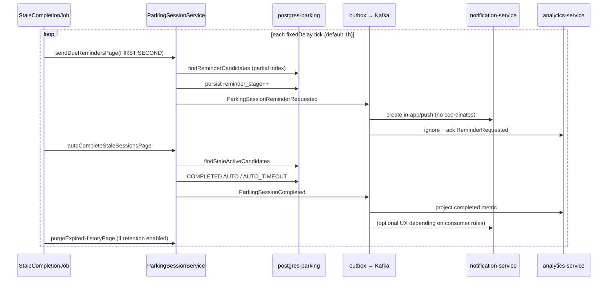

# Parking Session stale lifecycle

Engineer-facing overview of ACTIVE parking-session confirmation, reminders,
auto-completion, events, and retention.

| | |
|---|---|
| **Status** | Implemented (parking-service + consumers) |
| **Ops runbook** | [`docs/operations/parking-session-stale-runbook.md`](../operations/parking-session-stale-runbook.md) |
| **Event contracts** | [`PARKING-SESSION-LIFECYCLE-EVENTS.md`](PARKING-SESSION-LIFECYCLE-EVENTS.md), [`event-contracts.md`](event-contracts.md) |
| **Analytics** | [`PARKING-SESSION-ANALYTICS-INGESTION.md`](PARKING-SESSION-ANALYTICS-INGESTION.md) |
| **Security** | [`PARKING-SESSION-SECURITY-AUDIT.md`](PARKING-SESSION-SECURITY-AUDIT.md) |
| **Transport** | [`kafka-transport.md`](kafka-transport.md) |

## Architecture overview

```text
  Clients (web / mobile)
           │  HTTPS + Bearer
           ▼
     gateway-service  ──injects──► X-User-Id, X-Gateway-Auth
           │
           ▼
   parking-service
     • ParkingSessionController (HTTP)
     • ParkingSessionService (domain transitions + outbox append)
     • ParkingSessionStaleCompletionJob (@Scheduled)
     • ParkingOutboxRelay → Kafka topic parkio.parking.session
           │
           ├──────────────► notification-service (reminders → in-app/push)
           └──────────────► analytics-service (Started/Completed/Cancelled only)
```

Persistence: `parking_sessions` on `postgres-parking`. Scheduler mutations are
per-row (`REQUIRES_NEW`) with optimistic locking so concurrent nodes stay
idempotent.

## State machine

```text
                 start / claim
                      │
                      ▼
                   ACTIVE
                 /    │    \
     confirm-active   │     cancel
     (reset stage,    │        │
      lastConfirmedAt)│        ▼
                 │    │    CANCELLED
                 │    │    (MANUAL + non-AUTO reason)
                 │    │
         reminders│    complete (user)
         FIRST→SECOND  │
                 │     ▼
                 │  COMPLETED (MANUAL / MANUAL)
                 │
                 └── auto-complete (scheduler)
                        ▼
                   COMPLETED (AUTO / AUTO_TIMEOUT)

  Terminal rows may later be hard-deleted by optional retention
  (PARKIO_PARKING_SESSION_RETENTION_ENABLED, default false).
```

There is **no** `EXPIRED` session status. Forgotten ACTIVE sessions become
COMPLETED via AUTO_TIMEOUT.

Reminder stages are persisted (`reminder_stage` 0..2). Confirm-active resets
the stage and sets `lastConfirmedAt = now`, restarting the 24h / 48h / 72h
windows from the confirmation anchor.

## Sequence diagrams

### User confirm / complete

```mermaid
sequenceDiagram
  participant C as Client
  participant G as gateway-service
  participant P as parking-service
  participant DB as postgres-parking
  participant O as outbox → Kafka

  C->>G: POST /sessions/{id}/confirm-active (Bearer)
  G->>P: + X-User-Id + X-Gateway-Auth
  P->>DB: load by id+userId; set lastConfirmedAt; reminder_stage=0
  P-->>C: ParkingSessionResponse (no completionReason)

  C->>G: POST /sessions/{id}/complete (Idempotency-Key)
  G->>P: authenticated
  P->>DB: ACTIVE → COMPLETED MANUAL/MANUAL
  P->>O: ParkingSessionCompleted (same TX)
  P-->>C: 200 completed
```

### Scheduler reminder + auto-complete



## Scheduler lifecycle

Component: `ParkingSessionStaleCompletionJob`  
Condition: `parkio.lifecycle.parking-session-stale.enabled` (default true)  
Delay: `parkio.lifecycle.parking-session-stale.fixed-delay-ms` (default 3600000)

Per tick:

1. Drain FIRST reminders (pages of `scheduler-batch-size`, default 100)
2. Drain SECOND reminders
3. Drain auto-completes
4. Drain retention (no-op when disabled)
5. Refresh `parking.sessions.active` gauge

Page drain stops when a page is exhausted. Cap: 10_000 pages/tick (safety).
Failures increment `parking.sessions.scheduler.failed` and log
`Stale parking-session scheduler tick failed`.

Candidate queries rely on:

- `idx_parking_sessions_stale_active`
- `idx_parking_sessions_reminder_candidates`
- `idx_parking_sessions_terminal_ended` (retention)

See [`docs/operations/sql/parking-session-indexes-concurrent.md`](../operations/sql/parking-session-indexes-concurrent.md).

## Event / notification / analytics flows

| Wire eventType | Topic | notification-service | analytics-service |
|---|---|---|---|
| `ParkingSessionStarted` | `parkio.parking.session` | (optional) | project start |
| `ParkingSessionCompleted` | same | (optional) | project complete |
| `ParkingSessionCancelled` | same | (optional) | project cancel |
| `ParkingSessionReminderRequested` | same | create reminder | **ignore + ack** |

Atomicity: session save + outbox append in one transaction. No direct Kafka
publish on the request path. Key = `sessionId`. Privacy exclusions (no lat/lng
in reminder payloads) are locked in
[`PARKING-SESSION-LIFECYCLE-EVENTS.md`](PARKING-SESSION-LIFECYCLE-EVENTS.md).

## Configuration (single source of truth)

**Operational source:** parking-service `application.yml` /
`PARKIO_PARKING_SESSION_*` env vars (see runbook table).

**Client source of truth:**  
`GET /api/v1/parking/sessions/lifecycle-config`  
returns effective `confirmAfter` / `reminder2After` / `autoCompleteAfter`
(ms + ISO-8601) and reminder/auto-complete enable flags via
`ParkingSessionLifecycleConfigResponse`. Clients must not hardcode 24h / 48h /
72h.

Startup validates `confirm-after < reminder-2-after < auto-complete-after`
when building `ParkingSessionStalePolicy`.

## Deployment

1. Apply Flyway V17+V18 with parking-service.
2. Deploy/restart `parking-service`, then `notification-service`, then
   `analytics-service` (additive contracts tolerate other orders after
   migration if analytics ignores unknown reminder events).
3. Scrape metrics; open Grafana **Parkio — Parking Sessions (stale lifecycle)**.

## Monitoring

| Signal | Where |
|---|---|
| Scheduler failures / duration / processed | `parking_sessions_scheduler_*` |
| Reminders by stage | `parking_sessions_reminder_sent_total` |
| Auto-completes | `parking_sessions_auto_completed_total` |
| Active gauge | `parking_sessions_active` |
| Outbox | `parkio_outbox_*` on parking-service |
| Kafka lag | `kafka_consumergroup_lag` on `parkio.parking.session` |

Alerts live in `docker/prometheus/alerts.yml` group
`parkio-parking-session-stale`.

## Rollback and feature flags

Prefer flags before DB restore:

- `PARKIO_PARKING_SESSION_STALE_ENABLED=false` — disable job bean path
- `PARKIO_PARKING_SESSION_REMINDERS_ENABLED=false`
- `PARKIO_PARKING_SESSION_AUTO_COMPLETE_ENABLED=false`
- `PARKIO_PARKING_SESSION_NOTIFICATION_ENABLED=false`
- `PARKIO_PARKING_SESSION_RETENTION_ENABLED=false` (default)

Deploy rollback does not undo Flyway. See runbook sections 8–9.

## Retention

Disabled by default (`PARKIO_PARKING_SESSION_RETENTION_ENABLED=false`).
When enabled, terminal rows with `ended_at` older than `retention-after`
(default `P365D`) are hard-deleted in batches. User-initiated history delete
APIs remain separate (opaque ownership rules). See
[`PARKING-SESSION-DELETION-PRIVACY-DECISION.md`](PARKING-SESSION-DELETION-PRIVACY-DECISION.md).

## Related code map

| Area | Location |
|---|---|
| Policy | `ParkingSessionStalePolicy` |
| Job | `ParkingSessionStaleCompletionJob` |
| Service | `ParkingSessionService` |
| Metrics | `ParkingSessionLifecycleMetrics` |
| Migrations | `V17__parking_session_stale_handling.sql`, `V18__parking_session_lifecycle_evolution.sql` |
| HTTP | `ParkingSessionController` |